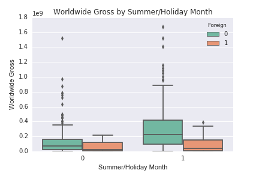

# Movie Regression Project

## Introduction

I would like to design a simple project to determine how successful a movie will be.

The measure of success will be based on the Worldwide Gross Revenue.

With many movies out there, it would be interesting to see if any specific features determine success.

## Challenge

There are many variables that can lead to the success of a film. Many films can be domestically successful but may not necessarily be an appealing movie worldwide.

Additionally, there are sub-genres with the main genres/themes so it would be helpful to narrow down the analysis to one overall theme.

I believe that ratings from a movie data source and time of year will have a strong positive impact on worldwide revenue.

## Data

- First 1000 Action Hero movies from IMDB
- IMDB scores, runtimes, ratings (G, PG, PG-13, R)
- IMDB Subgenres (Action, Adventure, etc.)
- the-numbers.com budgets, domestic gross, worldwide gross, release

## Exploratory Data Analysis

I explored specific features against Worldwide gross to see if there were any high correlations.

Looks like a positive relationship for domestic gross, budget and rating count. There is some positive relationship for runtime but a little more scattered.
PG-13 movies seem to have a much wider range for worldwide gross as well as non-foreign films.

## Feature Engineering

- Looking at the specific categorical variables, I decided to convert movies in the US, Canada, and UK as non-foreign and the rest of the movies as foreign
- I also converted the release date to be separated as non-peak vs. peak months (summer and holiday months).

## Regression

Initially, I ran the regression with all features excluding the directors (too long of a list).

I realized that the genres, except for thriller were statistically insignificant (p value > 0.05).

I ran the second model without the genres and found that movie rating (G to R), runtime, IMDB_Score, X_Factor (feature for the peak months), Rating_Count, User_Review_Count and Foreign were all statistically insignificant.

The final model consisted of Budget, DomesticGross, Thriller, and Critic_Review_Count.

Furious 7 was an outlier, according to the influence plot below. This could have been due to the fact that it was the last sequel where Paul Walker was featured in before his death. Worldwide gross was about 5 times domestic gross.

This shows a normal distribution of the residuals.

## Lessons Learned

I learned more beautifulsoup techniques for various websites. It was very time-consuming because of the amount of data you have to extract on top of the data cleaning and manipulation. Many of the categorical values had to be converted into a dummy variable so that the regression analysis could be performed.

Additionally, I would need to look into why my terminal cannot perform command based on the xml parser, which I know substantially increases performance.

## Further Analysis

If I had an unlimited amount of time, I would:
- Do further analysis on the influence of directors
- Include star actors into the dataset and determine their impact on worldwide gross

## Code Information

The Jupyter notebooks
